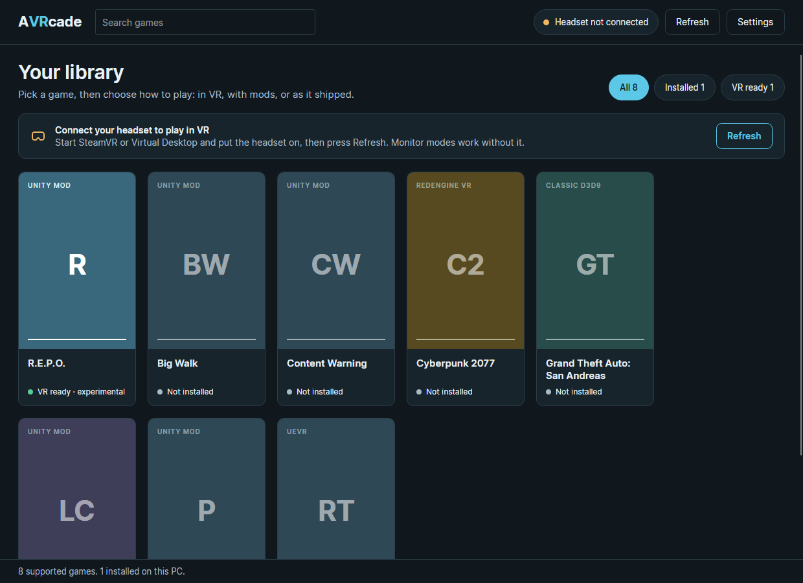
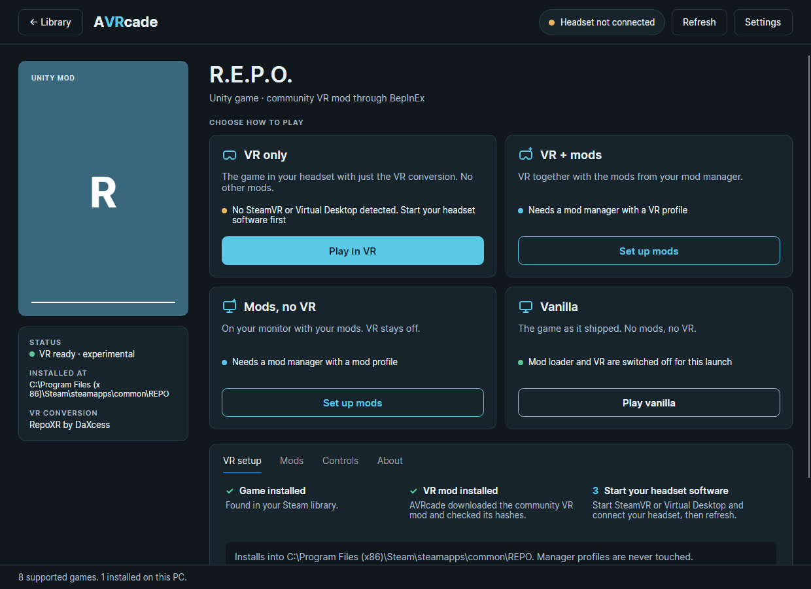
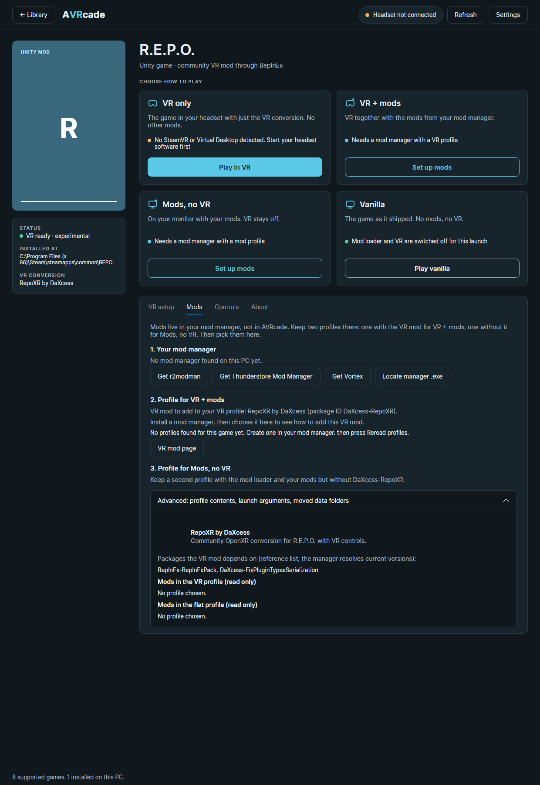

# AVRcade

Play the PC games you already own in VR from one library.

AVRcade finds your Steam games, sets up each game's VR conversion for you, and gives every game the same four launch buttons.



## Four ways to play every game

| Mode | What you get |
|---|---|
| **VR only** | The game in your headset with just its VR conversion. No other mods. |
| **VR + mods** | VR together with the mods from the mod manager you already use. |
| **Mods, no VR** | The game on your monitor with your mods. |
| **Vanilla** | The game as it shipped: no mods, no VR. |

A mode that is not ready says why and offers its one next step, such as *Install VR mod* or *Set up mods*.



## Supported games

| Game | How VR works | State |
|---|---|---|
| R.E.P.O. | [RepoXR](https://thunderstore.io/c/repo/p/DaXcess/RepoXR/) by DaXcess | Confirmed in a headset |
| Lethal Company | [LCVR](https://thunderstore.io/c/lethal-company/p/DaXcess/LethalCompanyVR/) by DaXcess | Confirmed in a headset |
| PEAK | [PeakVR](https://thunderstore.io/c/peak/p/Andrey04o/PeakVR/) by Andrey04o | Confirmed in a headset |
| Content Warning | [CWVR](https://thunderstore.io/c/content-warning/p/DaXcess/CWVR/) by DaXcess | Confirmed in a headset |
| Big Walk | [Big Walk VR](https://old.thunderstore.io/c/big-walk/p/CircuitLord/Big_Walk_VR/) by CircuitLord | Confirmed in a headset |
| RV There Yet? | [UEVR](https://github.com/praydog/UEVR) by praydog, with a community profile | Experimental |
| Grand Theft Auto: San Andreas (classic) | AVRcade's own Direct3D 9 to OpenXR bridge | Experimental; supports one specific classic `gta_sa.exe` build, which AVRcade checks before installing its bridge |
| Cyberpunk 2077 | RED4ext VR backend based on [cyberpunk-vr-port](https://github.com/dariulone/cyberpunk-vr-port) | Experimental; **Install VR backend** adds the VR plugins and downloads the modding frameworks they need. Supports one specific game build, which AVRcade checks first. Monitor modes work without it |

"Installs and launches" means AVRcade downloads the pinned mod, checks its hashes and starts the game with it. Whether a mod still matches the game's current build is up to that mod's author; the game page links to each project.

## What you need

- Windows 10 (1809 or later) or Windows 11, 64-bit.
- The games, owned and installed through Steam. AVRcade never downloads games. Classic San Andreas is no longer sold on Steam; point AVRcade at your own copy with *Locate installed game*.
- A PC VR headset connected through SteamVR or Virtual Desktop.
- For the two modded modes, a mod manager: r2modman, Thunderstore Mod Manager or Vortex for the Unity games, or whichever manager you already use for Cyberpunk 2077, San Andreas and Unreal games.

## Install

1. Download `AVRcade-Setup-<version>.exe` from the Releases page.
2. Run it. It installs for your user only and does not ask for administrator access.
3. Open AVRcade from the Start menu.

The installer bundles everything AVRcade itself needs, including its .NET runtime. Builds are not code-signed yet, so Windows SmartScreen may ask you to confirm.

A portable `AVRcade-<version>-win-x64.zip` is published beside the installer: unzip it anywhere and run `vrclient-app.exe`.

## First VR launch

1. Install the game in Steam.
2. Start SteamVR or Virtual Desktop and connect your headset. If both are running, AVRcade sends the game to SteamVR.
3. Open the game in AVRcade and press the button on **VR only**. The first press installs the VR mod; the next one plays.

## Playing VR with mods



For the Unity games, mods stay in your mod manager. Keep two profiles there: one that includes the game's VR mod, one without it. Pick them on the game's **Mods** tab, and **VR + mods** and **Mods, no VR** each launch their own profile through Steam. AVRcade reads profiles but never writes to them. Start the game once from the manager first, so it places its mod loader in the game folder.

Cyberpunk 2077, San Andreas and Unreal games load mods from the game folder, so any manager works. Choose yours on the **Mods** tab and AVRcade opens it for you.

More detail: [mod manager coexistence](docs/onboarding/MOD-MANAGER-COEXISTENCE.md).

## Safety

- VR conversions are mods. Use the modded modes only in private sessions with friends who agreed to it. AVRcade asks you to confirm before a modded launch.
- AVRcade refuses games that use anti-cheat.
- Every download is version-pinned and hash-verified before it is used.
- Removing a VR mod deletes only the files AVRcade added.

## Build from source

You need the [.NET 8 SDK](https://dotnet.microsoft.com/download/dotnet/8.0).

```powershell
dotnet build client/VrClient.sln -c Release
dotnet test  client/VrClient.sln -c Release
dotnet run --project client/VrClient.App -c Release
```

The app, the `vrclient` command-line tool and their tests live in `client/`. The native C++ parts (the San Andreas bridge and the experimental native adapters) are optional and need Visual Studio Build Tools 2022; see [tools/toolchain.md](tools/toolchain.md).

To build the installer, see [docs/release/WINDOWS-V0.2.md](docs/release/WINDOWS-V0.2.md).

### Repository layout

| Path | Contents |
|---|---|
| `client/VrClient.App` | The desktop app (Avalonia) |
| `client/VrClient.Core` | Game discovery, mod install, safety checks and launch logic, with no UI dependency |
| `client/VrClient.Cli` | The `vrclient` command-line tool and the Steam launch wrapper |
| `client/VrClient.Core.Tests` | Unit tests |
| `config/` | One set of data files per game: mod pack, pinned versions, safety policy, controller map |
| `adapters/`, `src/native/` | Native C++ VR bridges and experimental adapters |
| `docs/` | User guides, troubleshooting and design notes |

### Adding a game

A Unity game with a community VR mod on Thunderstore is added as data, without code: follow [docs/onboarding/ADD-A-GAME.md](docs/onboarding/ADD-A-GAME.md).

## Credits

AVRcade is a launcher. The VR conversions are the work of their authors, credited on each game's page and in the table above. Third-party components that AVRcade bundles or downloads are listed in [THIRD-PARTY-NOTICES.md](THIRD-PARTY-NOTICES.md).

AVRcade is not affiliated with or endorsed by Valve, the game publishers, or the mod and mod-manager authors. Game names are trademarks of their owners.

## License

AVRcade's own code is released under the [MIT License](LICENSE). AVRcade is free and will stay free.

The components it bundles or downloads keep their own licenses; see [THIRD-PARTY-NOTICES.md](THIRD-PARTY-NOTICES.md) and the texts in [licenses/](licenses/).
